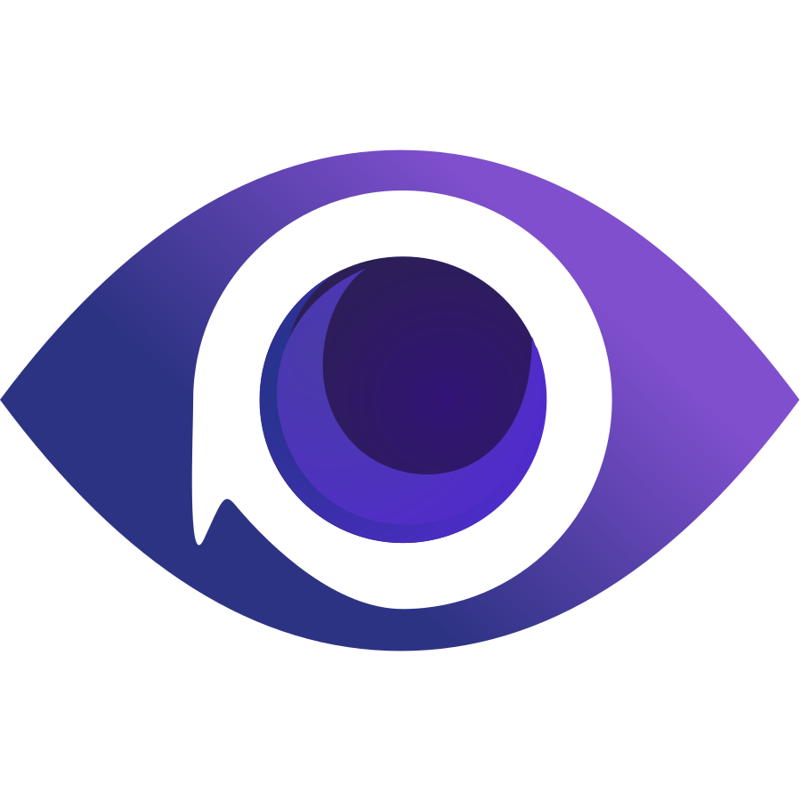
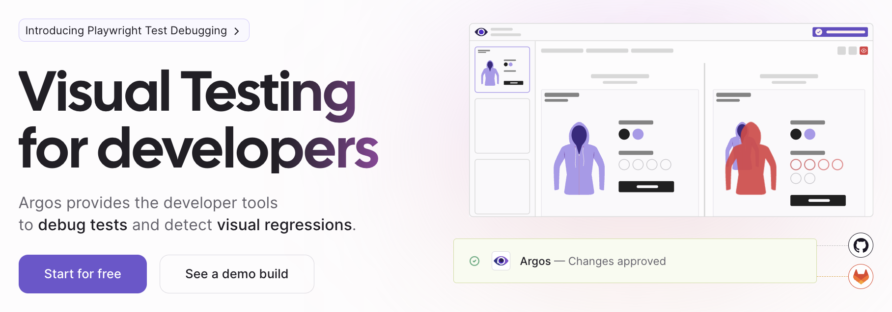

## Jeremy SFEZ

_Senior Software Fullstack Developer and Co-Founder of  argos, visual testing_

## 🌟 About Me

With a passion for coding and entrepreneurship, I've journeyed through various aspects of web development, constantly seeking to improve end-user experiences and streamline development processes. My adventure began in Paris, France, and has taken me into the heart of the tech world, collaborating with top French companies and co-founding Argos.

- 🔭 Freelance for top-notch French Companies
- 😍 Love to set up projects from scratch
- 🎯 Focus on fast delivery and end user experience
- 💬 Ask me about [Argos](http://argos-ci.com) or visual testing.
- 🌐 Connect with me on [LinkedIn](https://www.linkedin.com/in/jeremysfez) or [X](https://twitter.com/SfezJeremy)

## ⚡️ My Tech Stack

## 📘 Open Source

With a deep belief in the power of open source, I co-created Argos, a tool revolutionizing UI testing. Check out how [Argos](http://argos-ci.com) is changing the game in visual testing!

## ✍️ Top articles

- [Enforce API Stability with Zod and Argos](https://argos-ci.com/blog/zod-and-argos)
- [Startup Testing Dilemma: E2E or Not E2E?](https://argos-ci.com/blog/startup-testing-dilemma)
- [How to improve developer experience (DX) with visual testing](https://argos-ci.com/blog/improve-dx)
